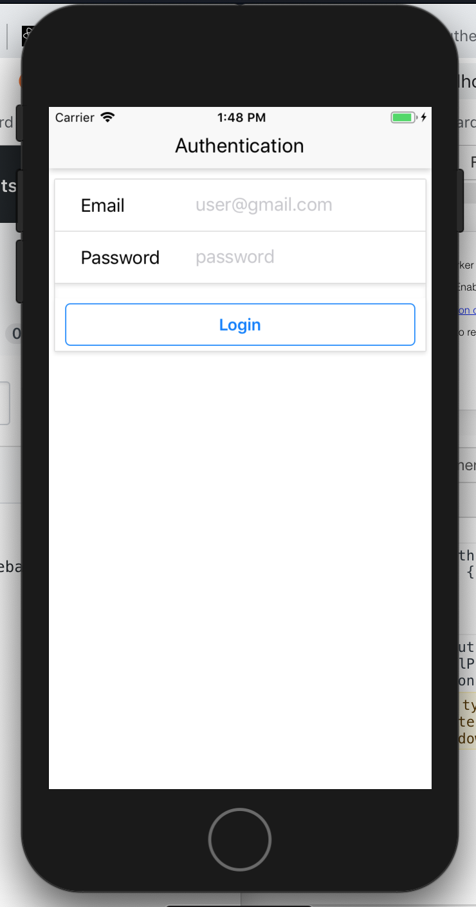
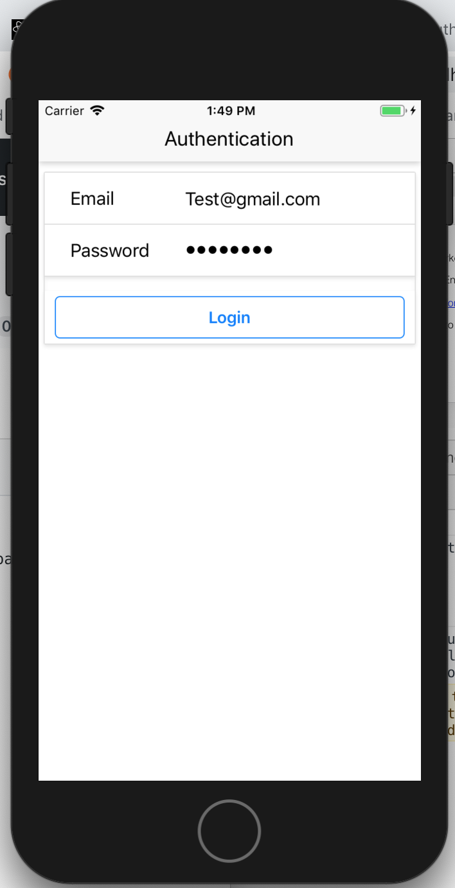
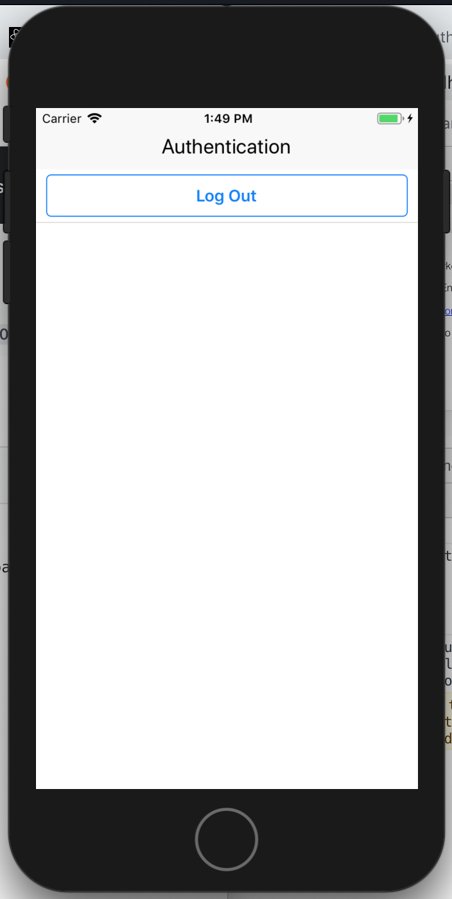

# react-native-authentication

App created to allow users to login to app using firebase and then logout.

To run the program:

1.  clone repo and run npm install
2.  Go to firebase and set up account and then create a project, click on website and then copy the user

var config = {
apiKey: "_",
authDomain: "_",
databaseURL: "_",
projectId: "_",
storageBucket: "_",
messagingSenderId: "_"
};

3.  Create a config.js file in root of project and paste this in with your credentials as:

module.exports = {
apiKey: '',
authDomain: '',
databaseURL: '',
projectId: '',
storageBucket: '',
messagingSenderId: ''
};

4.  To run on iphone: react-native run-ios
    To run on android: react-native run-android

    Can do any valid email, but need password to be 'password'

